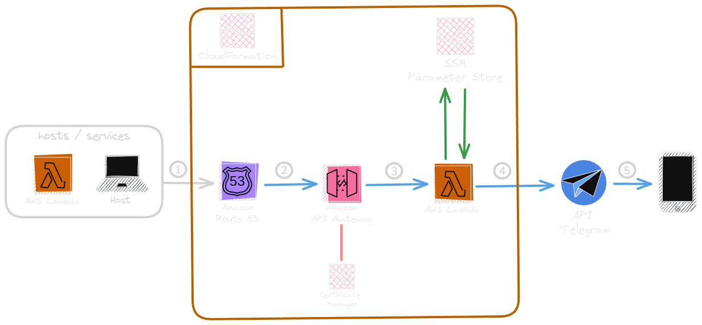

# Bot de Notificações com Integração AWS

## Objetivo

Este projeto foi desenvolvido para servir como uma **API**, onde outros serviços podem se integrar futuramente para enviar notificações diretamente para o bot do Telegram, permitindo notificações em tempo real.

## 🏗️ Arquitetura

Abaixo está uma imagem que descreve o fluxo da infraestrutura desenvolvida:



1. Serviços fazem a requisição para o endpoint.
2. O Route 53 redireciona para o API Gateway.
3. O API Gateway recebe a notificação, verifica se a API Key é válida e se não está com throttling ativo, e repassa para a função Lambda.
4. A função Lambda processa a mensagem, interage com o Parameter Store para obter o token do bot e o ID do usuário no Telegram, e faz a requisição para a API do Telegram.
5. A API do Telegram repassa a mensagem para o usuário final.

## 🖥️ Tecnologias Utilizadas

- **AWS Lambda**: Para execução serverless das funções.
- **AWS API Gateway**: Para gerenciamento de requisições HTTP.
- **SSM Parameter Store**: Para armazenar parâmetros seguros como tokens e IDs.
- **AWS Certificate Manager**: Para gerenciar certificados SSL/TLS e garantir uma comunicação segura.
- **Route 53**: Para gerenciamento de DNS, permitindo o roteamento de tráfego para a aplicação.
- **AWS SAM (Serverless Application Model)**: Para definir e gerenciar a infraestrutura usando IaC.
- **Python**: Linguagem usada para escrever a função Lambda.

## ⚙️ Como Usar

### Pré-requisitos

- [Instalar o AWS CLI](https://docs.aws.amazon.com/cli/latest/userguide/install-cliv2.html)
- [Instalar o AWS SAM CLI](https://docs.aws.amazon.com/serverless-application-model/latest/developerguide/install-sam-cli.html)
- [Instalar o Python 3.x](https://www.python.org/downloads/)

### Passos

1. Clone o repositório:

   ```bash
   git clone https://github.com/fabioalmeida08/AWSTelegramBot.git
   ```

2. Configure suas credenciais AWS:

   ```bash
   aws configure
   ```

3. Implante a infraestrutura usando AWS SAM:

   ```bash
   sam deploy --guided
   ```

4. Adicione as variáveis necessárias ao **SSM Parameter Store** para armazenar o token do bot do Telegram e o chat ID:

   ```bash
   aws ssm put-parameter --name "/Telegram/TokenBot" --value "SEU_TOKEN" --type SecureString
   aws ssm put-parameter --name "/Telegram/MyChatID" --value "SEU_CHAT_ID" --type String
   ```

5. Faça uma requisição de teste:
   - Envie uma notificação para o bot, incluindo o header com `x-api-key` e o valor da sua API Key:
   ```bash
   curl -X POST https://sua-api-url.com/notify \
   -H "x-api-key: SUA_API_KEY" \
   -d '{"message": "Teste de notificação"}'
   ```

## 🚧 Roadblocks

Mesmo Usando IaC algumas partes tiveram que ser feitas manuais:

1. **Criação de SecureString no Parameter Store via AWS SAM**:

   - Atualmente, não é possível criar valores do tipo **SecureString** no **SSM Parameter Store** usando AWS SAM. Para contornar isso, foi necessário criar os parâmetros via **AWS CLI**.
   - Detalhes sobre esse problema podem ser encontrados na [issue do CloudFormation](https://github.com/aws-cloudformation/cloudformation-coverage-roadmap/issues/82).

   Para criar os valores manualmente via CLI, use o seguinte comando:

   ```bash
   aws ssm put-parameter --name "/Telegram/TokenBot" --value "SEU_TOKEN" --type SecureString
   aws ssm put-parameter --name "/Telegram/MyChatID" --value "SEU_CHAT_ID" --type String
   ```

2. Como meu DNS registrar não era o Route 53, precisei registrar manualmente os nameservers do Route 53 no meu provedor de DNS. Isso envolveu algumas configurações manuais adicionais fora do IaC.
